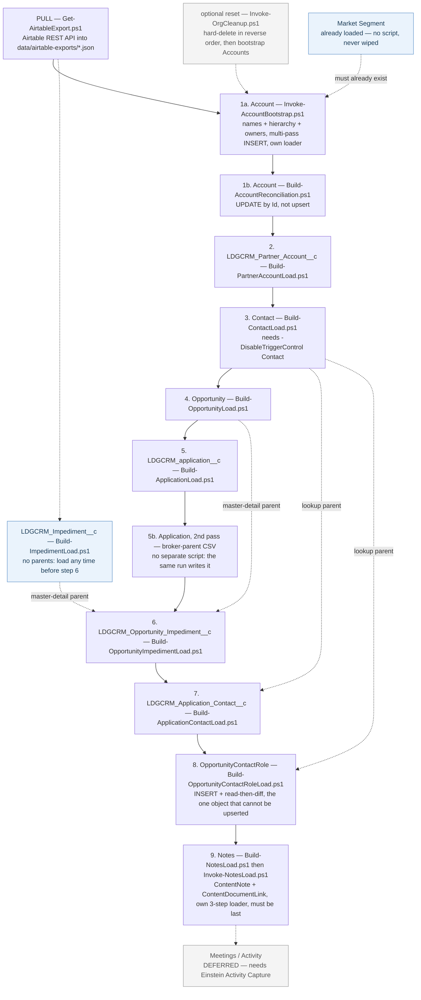

# Login.gov Airtable → Salesforce CRM Migration

This repo builds the Salesforce CRM app used by the Login.gov Airtable → Salesforce CRM migration
project, and the automation around it: pulling metadata from the Salesforce sandbox, exporting a
data dictionary, cleaning up test data, and pulling/transforming/loading migrated records from
Airtable via the Salesforce CLI's Bulk API.

Every script targets an **environment**, not a hard-coded org: `-Environment Dev|QA|Full|Prod`,
defaulting to **Dev**. See [Environments](#environments) below — and note that the alias `gsa-peo`
now means **production**, not the Dev sandbox it used to point at.

> For AI-agent-oriented conventions (data model, script patterns, gitignore rationale), see
> [CLAUDE.md](CLAUDE.md). This README is the human quick start.

## Environments

| `-Environment` | Alias | Sandbox | Instance URL | Used for |
| --- | --- | --- | --- | --- |
| `Dev` *(default)* | `peodv8dvn` | PEOdV8DVn | `https://gsa-peo--peodv8dvn.sandbox.my.salesforce.com` | Day-to-day development and pipeline testing |
| `QA` | `peodv15dvn` | PEOdV15DVn | `https://gsa-peo--peodv15dvn.sandbox.my.salesforce.com` | Full end-to-end migration rehearsal |
| `Full` | *not yet provisioned* | TBD | TBD | Operations team integration testing: scripts + change sets, immediately before production |
| `Prod` | `gsa-peo` | — | *(not authorized on this machine)* | The live GSA PEO org. Real partner data. |

**An alias is the org's own sandbox name**, so an alias cannot quietly drift from the org it names.
The registry lives in [`scripts/common/Common.Orgs.ps1`](scripts/common/Common.Orgs.ps1); nothing
else hard-codes an alias. Before reading or writing anything, scripts verify that the alias still
resolves to the org the registry claims — matching the instance URL against the expected sandbox
name and checking `Organization.IsSandbox` — and stop outright if it doesn't.

> ⚠️ **`gsa-peo` changed meaning on 2026-08-13.** It used to be the alias for the *Dev sandbox*,
> despite being the name of the *production* org. Every reference in this repo was updated in the
> same change, and the local `gsa-peo` alias was deleted, so any stale command line fails with "No
> authorization information found" rather than silently writing to production. Don't re-create that
> alias pointing anywhere but production.

Writes and deletes against `Prod` require typing the org alias at an extra confirmation gate, on top
of whatever the script already asks for.

## Repository layout

```
sfdx/                   Salesforce DX project (force-app, manifest, package.json, tests)
scripts/
  common/                Shared PowerShell helpers (logging, repo-root resolution)
  metadata/              Pull metadata + export the data dictionary from the sandbox
  cleanup/               Interactive, destructive record cleanup (+ optional Account bootstrap)
  data-migration/        Pull Airtable data, transform to load-ready CSVs, load into the target org
docs/                    Data-migration pipeline docs (architecture, field mappings, data-quality asks)
logs/                    Gitignored run output (transcripts, CSV exports)
data/                    Gitignored Airtable exports, prepped load CSVs, and mapping files
```

`logs/` and `data/` are gitignored on purpose — their contents can include PII pulled from Login.gov
applicants via Airtable or the sandbox. Only `.gitkeep`/`README.md` placeholders are tracked there.

## Prerequisites

- [Salesforce CLI](https://developer.salesforce.com/tools/salesforcecli) (`sf`)
- Windows PowerShell 5.1+ (`powershell`, built into Windows) — all automation scripts target this;
  they also run fine under [PowerShell 7+](https://learn.microsoft.com/powershell/scripting/install/installing-powershell)
  (`pwsh`) if you have it, but nothing in `scripts/` requires it
- Node.js (for `sfdx/`'s lint/test/prettier tooling — see `sfdx/package.json`)
- Access to the GSA PEO sandbox(es) you intend to target — see [Environments](#environments)

## Setup

```bash
# Authenticate once per machine, per environment. The alias is always the
# sandbox's own name; logging in at the sandbox's own My Domain URL (rather than
# the generic test.salesforce.com) means the browser lands on exactly the org
# the alias claims, so there's no way to attach the alias to the wrong sandbox.
sf org login web --alias peodv8dvn  --instance-url https://gsa-peo--peodv8dvn.sandbox.my.salesforce.com    # Dev
sf org login web --alias peodv15dvn --instance-url https://gsa-peo--peodv15dvn.sandbox.my.salesforce.com   # QA

# Verify the connection: "Instance Url" in the output must match the table above
sf org display --target-org peodv8dvn

# Optional: make Dev the default for bare `sf` commands that omit --target-org
sf config set target-org=peodv8dvn --global

# Install sfdx/ tooling (lint, prettier, jest, husky pre-commit hook)
cd sfdx && npm install

# If retrieving metadata into sfdx/force-app fails with "Filename too long",
# this machine's disk mount adds a long path prefix that trips Windows' 260-char
# limit on deeply nested Salesforce metadata paths. Fix once per clone:
git config core.longpaths true

# For the Airtable pull script: copy the template and fill in your own
# Personal Access Token + base ID (both gitignored, never commit .env)
cp .env.example .env
```

## Common tasks

Run these from the repo root with `powershell`:

```powershell
# Pull metadata listed in sfdx/manifest/package.xml into sfdx/force-app
powershell scripts/metadata/Sync-Metadata.ps1                      # Dev (default)
powershell scripts/metadata/Sync-Metadata.ps1 -Environment QA

# Export a full object/field data dictionary CSV to logs/metadata/
powershell scripts/metadata/Get-LDGCRMDataDictionary.ps1
```

**Destructive — test-data cleanup, with optional Account bootstrap:**

```powershell
powershell scripts/cleanup/Invoke-OrgCleanup.ps1                   # Dev (default)
powershell scripts/cleanup/Invoke-OrgCleanup.ps1 -Environment QA
```

Hard-deletes records (only rows where `LDGCRM_External_ID__c` is set) after a typed `HARD DELETE`
confirmation, exporting the deleted IDs to `logs/cleanup/` first as an audit trail. Read the prompts.

Once the deletes finish it **offers to bootstrap the Account tree** from
`data/peo-prod-accounts-<date>.xls`, if that export is present. That matters because the pipeline
*reconciles onto existing Accounts* rather than creating them, so a freshly cleaned (or freshly
refreshed) org has nothing for the later loads to attach to. Answer the prompt, or drive it
non-interactively with `-BootstrapAccounts` / `-SkipBootstrap`.

**Resetting an org for a full migration rehearsal** is therefore one command followed by the normal
pipeline:

```powershell
powershell scripts/cleanup/Invoke-OrgCleanup.ps1 -Environment QA -BootstrapAccounts
```

The bootstrap can also be run on its own — always dry-run it first:

```powershell
powershell scripts/data-migration/Invoke-AccountBootstrap.ps1 -Environment QA -PlanOnly
powershell scripts/data-migration/Invoke-AccountBootstrap.ps1 -Environment QA
```

Every script writes a transcript (and any CSV output) under `logs/<category>/` via
`scripts/common/Common.ps1`, so history of what ran and when is always available locally, without
ever needing to be committed.

## Salesforce app changes

Standard SFDX workflow inside `sfdx/`:

```bash
cd sfdx
npm run lint              # ESLint over aura/lwc JS
npm test                  # sfdx-lwc-jest
npm run prettier:verify   # Prettier check
sf project deploy validate --source-dir force-app --target-org peodv8dvn
sf project deploy start    --source-dir force-app --target-org peodv8dvn
```

The Husky `pre-commit` hook runs `lint-staged` (Prettier + ESLint + related Jest tests) automatically.

> **Known issue:** `deploy validate` (and any `deploy start` that runs tests) currently fails
> org-wide due to a pre-existing Apex compile error in an unrelated app (FCIC) that shares this
> sandbox — not something caused by changes in this repo. See `CLAUDE.md`'s "Operational gotchas"
> for the `--test-level NoTestRun` workaround for metadata-only changes with no Apex involved.

## Data migration

Moves data from Airtable into the target org, in three stages — pull, prep/transform, load. See
[docs/README.md](docs/README.md) for the full pipeline and
build status, and
[docs/TRANSFORMATION-RULES.md](docs/TRANSFORMATION-RULES.md)
for the field-by-field mapping rules and every data-quality gotcha found per object.
[docs/AIRTABLE-DATA-QUALITY-REQUESTS.md](docs/AIRTABLE-DATA-QUALITY-REQUESTS.md) is the
non-developer-facing list of Airtable data issues blocking the migration — that's the file to hand to
whoever maintains the Airtable base.

**Loaded into the Dev sandbox so far:** Market Segment, Account (588 reconciled of 1,350), Partner
Account (74), Impediment (39), Application (688), Opportunity (742), Contact (1,483), and the
Application↔Contact junction (1,880), the Impediment↔Opportunity junction (267), and
OpportunityContactRole (515). Meetings are deferred pending Einstein Activity Capture; every other
chunk, Notes included, is built — see `docs/README.md` for per-script build status.

### The load sequence

Every step is **run by hand, one at a time**: run the transform, read its review CSVs, load, verify,
*then* start the next one. Order is not a style preference — a lookup resolves by external ID at load
time, and the Bulk API rejects the **whole row** when the record it points at doesn't exist yet, so
loading out of order silently withholds records rather than erroring loudly.



Solid arrows are the order you run things in; dotted arrows are the lookups that *force* that order.

Every step goes through `Invoke-SalesforceLoad.ps1 -Operation Upsert`, keyed on
`LDGCRM_External_ID__c`, **except the four rows below that say otherwise** — two objects bring their
own loader, one is an Id-keyed update, and one can only be inserted:

| # | Object | Transform script | Load file → operation |
| --- | --- | --- | --- |
| — | `LDGCRM_Market_Segment__c` | *(none — already loaded, excluded from cleanup)* | — |
| 1a | Account *(create)* | `Invoke-AccountBootstrap.ps1` | *loads itself* → multi-pass INSERT |
| 1b | Account *(reconcile)* | `Build-AccountReconciliation.ps1` | `Account-update.csv` → **Update** (Id-keyed) |
| 2 | `LDGCRM_Partner_Account__c` | `Build-PartnerAccountLoad.ps1` | `LDGCRM_Partner_Account__c-upsert.csv` |
| 3 | Contact | `Build-ContactLoad.ps1` | `Contact-upsert.csv` → **+ `-DisableTriggerControl "Contact"`** |
| 4 | Opportunity | `Build-OpportunityLoad.ps1` | `Opportunity-upsert.csv` |
| 5 | `LDGCRM_application__c` | `Build-ApplicationLoad.ps1` | `LDGCRM_application__c-upsert.csv` |
| 5b | `LDGCRM_application__c` *(self-lookup)* | *(no second script — same run writes it)* | `LDGCRM_application__c-broker-parent-upsert.csv` |
| — | `LDGCRM_Impediment__c` *(no parents — any time before 6)* | `Build-ImpedimentLoad.ps1` | `LDGCRM_Impediment__c-upsert.csv` |
| 6 | `LDGCRM_Opportunity_Impediment__c` | `Build-OpportunityImpedimentLoad.ps1` | `LDGCRM_Opportunity_Impediment__c-upsert.csv` |
| 7 | `LDGCRM_Application_Contact__c` | `Build-ApplicationContactLoad.ps1` | `LDGCRM_Application_Contact__c-upsert.csv` |
| 8 | `OpportunityContactRole` | `Build-OpportunityContactRoleLoad.ps1` | `OpportunityContactRole-insert.csv` → **Insert** |
| 9 | Notes (`ContentNote`) | `Build-NotesLoad.ps1` | `Invoke-NotesLoad.ps1` → **its own 3-step loader** |

Four things about that sequence are load-order traps rather than preferences:

- **Opportunity before Application**, even though Application's Opportunity lookup is *optional* —
  "optional" means *may be blank*, not *may point at something that doesn't exist*. Getting this
  backwards cost 99 rows on the first real load.
- **Application's second pass is a separate load, not a separate script.** A self-referential lookup
  can't resolve against another row in its own batch, so `Build-ApplicationLoad.ps1` writes a second
  CSV that must be loaded *after* the main one.
- **`OpportunityContactRole` can never be upserted** — Salesforce forbids External ID fields on that
  object outright, so it reads what exists and inserts only the difference. Re-running is safe; a
  half-cleaned org is not.
- **Notes are last by definition.** A note attaches to a parent record, so every other object has to
  exist first.

⚠️ **Loading Contact temporarily disables another app's Apex trigger** (`-DisableTriggerControl`) —
read "Loading Contact" in [docs/README.md](docs/README.md) before running it.

For a full wipe-and-reload rehearsal, work through
[docs/RELOAD-QA-CHECKLIST.md](docs/RELOAD-QA-CHECKLIST.md) instead of this summary — it carries the
per-step expected counts, the verification queries, and the side-effect sweep.

### Running a single chunk

```powershell
# Pull every table straight from the Airtable REST API into data/airtable-exports/<Table>.json
# (overwrites each run). Requires AIRTABLE_API_KEY + AIRTABLE_BASE_ID in .env — see Setup above.
powershell scripts/data-migration/Get-AirtableExport.ps1

# Transform a pulled table into a load-ready CSV in data/salesforce-loads/
powershell scripts/data-migration/Build-ImpedimentLoad.ps1

# Load a prepped CSV into the target org (prompts "Type LOAD to continue")
powershell scripts/data-migration/Invoke-SalesforceLoad.ps1 `
    -ObjectApiName "LDGCRM_Impediment__c" `
    -CsvFile "data/salesforce-loads/LDGCRM_Impediment__c-upsert.csv"
```

Loading uses the Salesforce CLI's Bulk API (`sf data upsert bulk`/`sf data update bulk`), not the
Data Loader CLI originally planned — that tool isn't installed in this environment and needs Java
11+, while `sf` is already installed and used everywhere else in this repo. See the pipeline
README's Stage 3 section for the full reasoning. Every load is keyed on `LDGCRM_External_ID__c` for
idempotent upserts, except Account, which is a Salesforce-`Id`-keyed update (Accounts already exist
independently of this migration — see `docs/TRANSFORMATION-RULES.md`).
